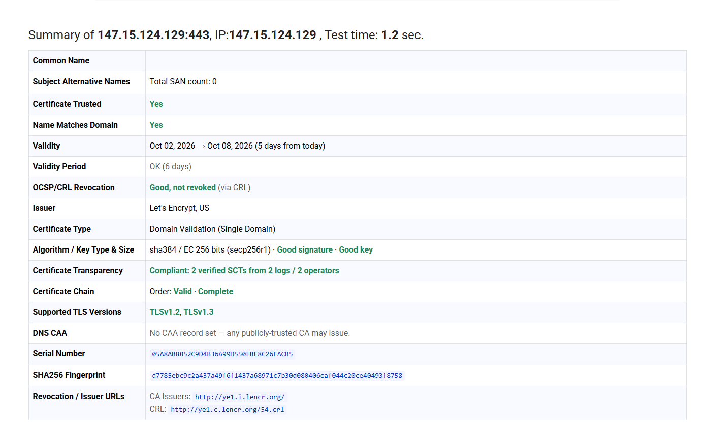

# SSL.org — certificado por IP público

- **Alvo:** `147.15.124.129:443`
- **Ferramenta:** [SSL Certificate Checker — SSL.org](https://www.ssl.org/)
- **Coleta:** 03 de outubro de 2026
- **Resultado:** aprovado para os critérios de confiança e assinatura exigidos no escopo.

## Resultado reportado pelo SSL.org

| Verificação | Resultado |
|---|---|
| Certificate Trusted | **Yes** |
| Name Matches Domain | **Yes** |
| Validade | 02/10/2026 a 08/10/2026 |
| Status de validade | OK (6 dias) |
| Revogação OCSP/CRL | Good, not revoked (via CRL) |
| Emissor | Let's Encrypt, US (`YE1`) |
| Tipo | Domain Validation (Single Domain) |
| Algorithm / Key Type & Size | `sha384 / EC 256 bits (secp256r1) · Good signature · Good key` |
| Certificate Transparency | Compliant: 2 verified SCTs from 2 logs / 2 operators |
| Cadeia | Order: Valid · Complete |
| TLS suportado | TLS 1.2 e TLS 1.3 |

O relatório atende ao requisito do escopo para endereço IP público: `Certificate Trusted: YES` e assinatura/chave aceitáveis.

## Captura do resultado

> O SSL.org executa o relatório de forma dinâmica no navegador e não expõe uma URL pública permanente para esse resultado. Esta evidência preserva a captura e os campos retornados pela consulta externa, incluindo IP, data, emissor, confiança, cadeia e algoritmo.
